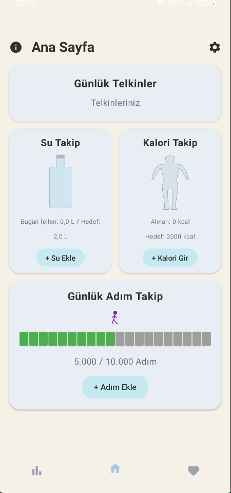
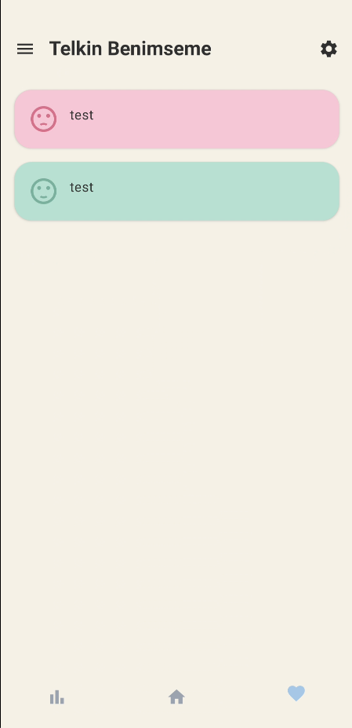
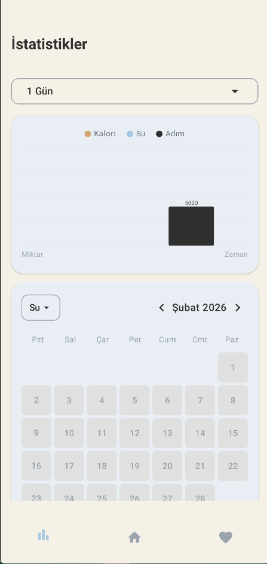
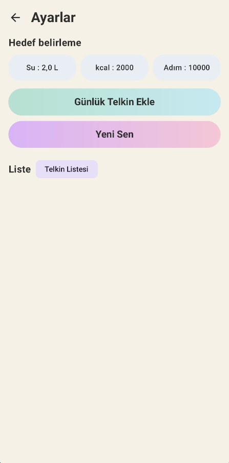

<div align="center">

# 🧘 JustYOU

### Personal Wellness & Social Anxiety Management App

[](https://developer.android.com)
[](https://kotlinlang.org)
[](https://developer.android.com/jetpack/compose)
[](https://developer.android.com/about/versions/oreo)
[](LICENSE)

**JustYOU** is a modern Android wellness application focused on **social anxiety management** and **personal development**. Track your daily water, calorie, and step intake, create positive affirmation cards, learn about social anxiety through educational content, and challenge yourself with a 10-step fear hierarchy.

[📥 Download APK](#-installation) · [📸 Screenshots](#-screenshots) · [✨ Features](#-features)

</div>

---

## 📸 Screenshots

<div align="center">
<table>
  <tr>
    <td align="center"><b>Home</b></td>
    <td align="center"><b>Affirmations</b></td>
    <td align="center"><b>Statistics</b></td>
    <td align="center"><b>Settings</b></td>
  </tr>
  <tr>
    <td></td>
    <td></td>
    <td></td>
    <td></td>
  </tr>
</table>
</div>

---

## ✨ Features

### 🏠 Home Screen (Ana Sayfa)
- **Water Tracking** — Monitor your daily water intake (ml) with an interactive tracker
- **Calorie Tracking** — Keep track of your daily calorie consumption (kcal)
- **Step Tracking** — Count your daily steps toward your goal
- **Daily Affirmation** — Get inspired with a daily positive affirmation card

### 💖 Affirmation Adoption (Telkin Benimseme)
- View and cycle through your custom positive affirmation cards
- **"Yeni Sen" (New You)** — Transform negative thoughts into positive ones with paired thought cards
- Access Education and Challenge sections via the navigation drawer

### 📊 Statistics (İstatistikler)
- **Weekly & Monthly Charts** — Visualize your water, calorie, and step data over time
- **Calendar View** — Navigate through weeks and months to review your progress
- **Multi-metric Graphs** — Compare all three metrics (calories, water, steps) in a single chart with color-coded legends

### 📚 Education (Eğitim)
- Learn about social anxiety with curated educational content
- Understand symptoms, coping mechanisms, and strategies

### 🏆 Challenge
- Complete a **10-step fear hierarchy** to gradually overcome social anxiety
- Track your progress step by step

### ⚙️ Settings (Ayarlar)
- **Customize Goals** — Set personalized daily targets for water (ml), calories (kcal), and steps
- **Manage Affirmations** — Add or remove positive affirmation cards
- **Manage "New You" Thoughts** — Create negative-to-positive thought transformation pairs

### ℹ️ About (Bilgi)
- Learn about the app's purpose and how to use each feature

---

## 🏗️ Tech Stack

| Technology | Description |
|---|---|
| **Kotlin** | Primary programming language |
| **Jetpack Compose** | Modern declarative UI toolkit |
| **Material 3** | Latest Material Design components |
| **Room Database** | Local data persistence with SQLite |
| **Navigation Compose** | Type-safe navigation between screens |
| **Coroutines & Flow** | Asynchronous programming & reactive data streams |
| **ViewModel** | MVVM architecture for UI state management |
| **KSP** | Kotlin Symbol Processing for annotation processing |
| **Google Fonts** | Inter font family via Compose integration |

---

## 📐 Architecture

The app follows the **MVVM (Model-View-ViewModel)** architecture pattern:

```
app/
├── data/
│   ├── entity/          # Room database entities (DailyTracking, UserGoals, Affirmation, etc.)
│   ├── dao/             # Data Access Objects
│   ├── WellnessDatabase # Room database configuration
│   └── WellnessRepository  # Single source of truth for data
├── ui/
│   ├── screens/         # Composable screen functions
│   │   ├── AnaSayfaScreen       # Home screen with trackers
│   │   ├── TelkinScreen         # Affirmation adoption screen
│   │   ├── IstatistikScreen     # Statistics & charts
│   │   ├── AyarlarScreen        # Settings screen
│   │   ├── EgitimScreen         # Education content
│   │   ├── ChallengeScreen      # Fear hierarchy challenge
│   │   └── BilgiScreen          # About/Info screen
│   ├── components/      # Reusable UI components (WaterTracker, CalorieTracker, StepTracker)
│   ├── navigation/      # App navigation graph
│   └── theme/           # Colors, typography, and theming
├── viewmodel/           # ViewModels for each screen
├── MainActivity.kt      # Entry point
└── JustYouApplication.kt  # Application class with database initialization
```

---

## 📥 Installation

### Download APK (Recommended)

1. Go to the [**Latest Release**](https://github.com/carus10/JustYou/releases/tag/v1.0.0)
2. Download the **[JustYOU.apk](https://github.com/carus10/JustYou/releases/download/v1.0.0/JustYOU.apk)** file
3. Enable **"Install from unknown sources"** on your Android device
4. Open the downloaded APK and install

> **Minimum Requirement:** Android 8.0 (API 26) or higher

### Build from Source

1. **Clone the repository**
   ```bash
   git clone https://github.com/carus10/JustYou.git
   ```

2. **Open in Android Studio**
   - Open Android Studio
   - Select `File > Open` and navigate to the cloned directory

3. **Build and Run**
   ```bash
   ./gradlew assembleDebug
   ```
   Or simply click the **Run** button in Android Studio.

---

## ⚙️ Requirements

| Requirement | Version |
|---|---|
| Android OS | 8.0+ (API 26) |
| Target SDK | 35 |
| Compile SDK | 35 |
| Java | 17 |
| Gradle | Kotlin DSL |

---

## 🧪 Testing

The project includes both unit tests and instrumented tests:

```bash
# Run unit tests
./gradlew test

# Run instrumented tests
./gradlew connectedAndroidTest
```

**Testing frameworks used:**
- JUnit 4
- Kotest (Runner, Assertions, Property-based testing)
- Espresso
- Compose UI Testing

---

## 🤝 Contributing

Contributions are welcome! Feel free to open an issue or submit a pull request.

1. Fork the repository
2. Create your feature branch (`git checkout -b feature/amazing-feature`)
3. Commit your changes (`git commit -m 'Add some amazing feature'`)
4. Push to the branch (`git push origin feature/amazing-feature`)
5. Open a Pull Request

---

## 📄 License

This project is open source and available under the [MIT License](LICENSE).

---

<div align="center">

**Made with ❤️ for mental wellness**

⭐ Star this repository if you find it helpful!

</div>